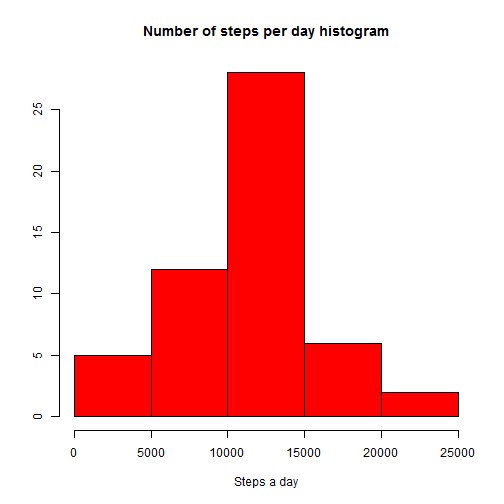
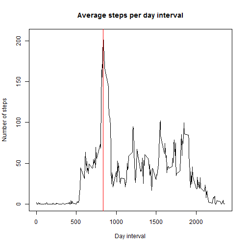
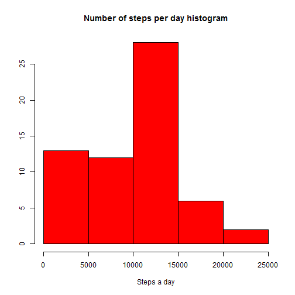
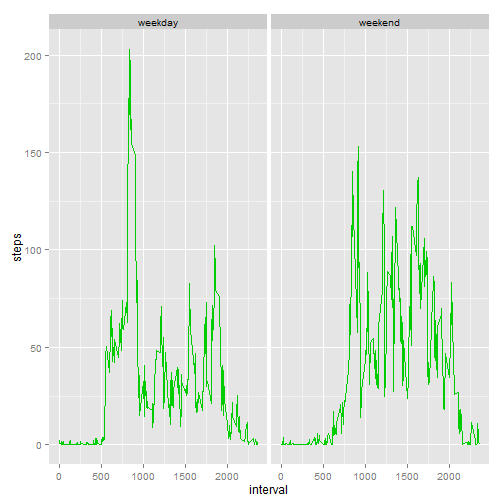

## Setting up and loading packages

```r
library(dplyr)
library(ggplot2)
library(knitr)
Sys.setlocale("LC_TIME", "English")
```

## Loading and preprocessing the data


```r
activity <- read.csv("activity.csv", sep = ",", header = TRUE)
```

## What is mean total number of steps taken per day?

Let's create a dataset, contaning the total number of steps taken each day


```r
Day_Steps <-
  (activity %>% group_by(date) %>% summarise_each(funs(sum = sum(steps, na.rm=TRUE))))[,-3]
```


```
## Source: local data frame [61 x 2]
## 
##          date steps
## 1  2012-10-01     0
## 2  2012-10-02   126
## 3  2012-10-03 11352
## 4  2012-10-04 12116
## 5  2012-10-05 13294
## 6  2012-10-06 15420
## 7  2012-10-07 11015
## 8  2012-10-08     0
## 9  2012-10-09 12811
## 10 2012-10-10  9900
## ..        ...   ...
```


```r
str(Day_Steps)
```

```
## Classes 'tbl_df' and 'data.frame':	61 obs. of  2 variables:
##  $ date : Factor w/ 61 levels "2012-10-01","2012-10-02",..: 1 2 3 4 5 6 7 8 9 10 ...
##  $ steps: int  0 126 11352 12116 13294 15420 11015 0 12811 9900 ...
```

Now we can make a histogram of the total number of steps taken each day:


```r
hist(
  Day_Steps$steps[!Day_Steps$steps == 0], xlab = "Steps a day",
  ylab = '',
  col = 2,
  main="Number of steps per day histogram"
  )
```

 

Based on the *Day_Steps* dataset, calculate the mean and median values of the total number of steps taken per day:


```r
mean(Day_Steps$steps[!Day_Steps$steps == 0])
```

```
## [1] 10766.19
```

```r
median(Day_Steps$steps[!Day_Steps$steps == 0])
```

```
## [1] 10765
```

Zero values are filtered out as they are produced by NA values in the original data.

## What is the average daily activity pattern?

To answer this question, fist need to create a dataset for the intervals with the average number of steps taken, averaged across all days.


```r
plot(Day_Intervals$interval, Day_Intervals$steps, 
     type = 'n',
     xlab = "Day interval", ylab = "Number of steps",
     main = "Average steps per day interval")

points(Day_Intervals$interval, Day_Intervals$steps, type = "l")
abline(v = (Day_Intervals[Day_Intervals$steps ==  max(Day_Intervals$steps),])[,1], lty = 1, col = 2)
```

 


```r
as.list((Day_Intervals[Day_Intervals$steps ==  max(Day_Intervals$steps),]))[1]
```

```
## $interval
## [1] 835
```

As we can see here, the **835**'th interval contains the maximum number of steps on average across all the days.

## Imputing missing values


The original dataset contains **2304** missing values, as we can see below:


```r
sum(is.na(activity$steps))
```

```
## [1] 2304
```

Let's create a new dataset that is equal to the original dataset but with the missing data filled in with the average number of steps for the interval across all days.
Here is the dataset for these mean values:


```r
Interval_Mean_Steps <-
  (activity %>% group_by(interval) %>% summarise_each(funs(mean = mean(steps, na.rm=TRUE))))[,-3]
```


```
## Source: local data frame [288 x 2]
## 
##    interval     steps
## 1         0 1.7169811
## 2         5 0.3396226
## 3        10 0.1320755
## 4        15 0.1509434
## 5        20 0.0754717
## 6        25 2.0943396
## 7        30 0.5283019
## 8        35 0.8679245
## 9        40 0.0000000
## 10       45 1.4716981
## ..      ...       ...
```

Merging this dataset with the original one, by the **interval** column, we are getting the new dataset, with the missing data filled in.

```r
activity_new <- merge(activity, Interval_Mean_Steps, by = "interval" , all.x = TRUE, sort = FALSE)

colnames(activity_new)[2] <- "steps"
colnames(activity_new)[4] <- "avg_steps"

# replacing the NA values with the rounded average number of steps for the interval across all days
activity_new$steps[is.na(activity_new$steps)] <- round(activity_new$avg_steps)

activity_new <- activity_new[,-4]
```

As we have already been doing at the first step, make a histogram of the total number of steps taken each day:


```r
hist(
  ((activity_new %>% group_by(date) %>% summarise_each(funs(sum = sum(steps))))[,-1])$steps,
  xlab = "Steps a day", ylab = '',
  col = 2,
  main="Number of steps per day histogram")
```

 

The histigram shows that the imputed values mainly increase the number of days in which the number of steps are less than 5000.

## Are there differences in activity patterns between weekdays and weekends?

Create a factor variable with two levels – “weekday” and “weekend” indicating whether a given date is a weekday or weekend day:

```r
activity_new$weekday <- ifelse(
                         weekdays(as.Date(activity_new$date)) == "Sunday" |
                         weekdays(as.Date(activity_new$date)) == "Saturday",
                         "weekend", "weekday"
                         )
activity_new$weekday <- as.factor(activity_new$weekday)
```

Make a panel plot of the 5-minute interval and the average number of steps taken, averaged across all weekday days or weekend days:


```r
g <- ggplot(
  (activity_new %>% group_by(interval,weekday) %>% summarise_each(funs(mean = mean(steps))))[,-4],
  aes(interval, steps)
  )
g + geom_line(aes(group=weekday), col = 3) + facet_grid(. ~ weekday)
```

 

We see that the daily activity on weekdays is higher in the intervals 500-1000, which are probably corresponds to commuting time for workers in the morning. Then, during a day, at the weekend, people are more active on average than at weekdays.
